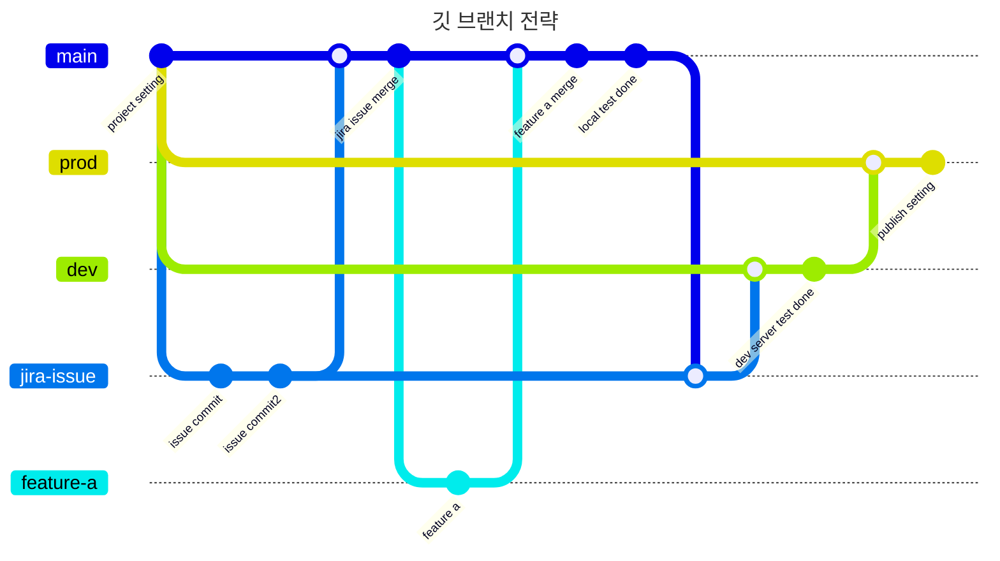

# Front project for Qualcosa web

---

## 프로젝트 세팅 방법

1. 프로젝트를 클론 받는다 (개인에게 할당 해준 codecommit 계정과 자격증명으로 연결)

```
git clone https://git-codecommit.ap-northeast-1.amazonaws.com/v1/repos/qualcosa-web
```

2. 프로젝트 폴더로 이동
3. 깃 커밋 컨벤션 설정을 위한 깃 훅스 설정

```
yarn commit-config
```

4. 모듈 설치

```
yarn
```

5. 프로젝트 실행 방법 (yarn 기준)

- 개발자 모드 실행
  ```
  yarn dev
  ```
- 프로젝트 빌드
  ```
  yarn build
  ```
- 프로젝트 실행
  ```
  yarn start
  ```
- 프로젝트 린트 검사
  ```
  yarn lint
  ```
- 스토리북 실행
  ```
  yarn storybook
  ```

## 깃 브랜치 종류

- [ main branch ] : local 작업사항
- [ dev branch ] : 개발 서버 배포 작업사항
- [ prod branch ] : 프로덕션 서버 배포 작업사항
- [ {{jira issue number}} branch ] : 기능개발 브랜치
- [ feature-{{feature name}} branch ] : 개발에 필요한 로컬내 개별 브랜치

## 깃 브랜치 전략



## 커밋 메세지 규칙

[ 커밋 타입 ]

- feat: 새로운 기능 추가
- fix: "잘못된" 코드 수정
- update: "정상적인" 기존 기능 개선 및 추가
- dev: 개발 환경 관련
- doc: 개발 문서 관련

```
# example commit
feat: {{이런 커밋으로 보냅니다.}}
```

## 파일명 / 클래스명 / 변수명 / 함수명 규칙

- 변수명 / 함수명 규칙 : 카멜케이스 camelCase (단, 컴포넌트 명은 파스칼 pascal)
  ```javascript
  const variableSample = '';
  const functionSample = () => {};
  const Component = () => {};
  ```
- 클래스명 규칙 : 케밥 kebab
  ```html
  <div class="class-name"></div>
  ```
- 파일명 규칙 : 케밥 kebab

## 폴더 구조

```
qualcosa-web                     //
├─ .eslintrc.json                // 린트 파일
├─ .prettierrc                   // 프리티어 파일
├─ .storybook                    // 스토리북 설정 관리 폴더
│  ├─ main.ts                    // 스토리북 설정 파일 (환경 설정)
│  └─ preview.ts                 // 스토리북 설정 파일 (미리보기 설정)
├─ app                           // app 라우팅 폴더
│  ├─ [lang]                     // 루트 폴더 (다국어 적용으로 루트로 사용)
│  │  ├─ layout.tsx              // 루트 레이아웃 파일
│  │  └─ page.tsx                // 루트 페이지 파일
│  ├─ favicon.ico                // 파비콘
│  └─ globals.css                // 전역 css 파일
├─ components                    // 컴포넌트 관리 폴더
│  ├─ common                     // 공통 컴포넌트 폴더
│  │  └─ locale-switcher.tsx     // i18n 다국어 변경 컴포넌트 파일
│  ├─ layouts                    // 레이아웃 컴포넌트 폴더
│  └─ pages                      // 페이지 종속 컴포넌트 폴더
├─ config                        // 설정 관리 폴더
│  └─ dictionaries               // 다국어 폴더
│     ├─ en.json                 // en(영어) 다국어 텍스트 샘플 파일
│     ├─ get-dictionary.ts       // i18n 관련 다국어 활용 파일
│     └─ nl.json                 // nl(네덜란드) 다국어 텍스트 샘플 파일
├─ hooks                         // hooks 관리 폴더
│  └─ prepare-commit-msg         // git commit 규칙 설정 파일
├─ i18n-config.ts                // i18n 설정파일
├─ lib                           // 기능 관리 폴더
│  ├─ api                        // api 관련 폴더
│  └─ utils                      // 유틸기능 관련 폴더
├─ middleware.ts                 // 넥스트js 미들웨어 파일
├─ next.config.js                // 넥스트js 설정파일
├─ package.json                  // 패키지 관리 파일
├─ postcss.config.js             // postcss 설정파일
├─ public                        // 퍼블릭 접근 폴더
├─ readme.md                     // 리드미파일
├─ stores                        // 글로벌 상태 폴더 (zustand 사용)
├─ stories                       // 스토리북 컴포넌트 폴더
├─ styles                        // 스타일 폴더
│  └─ test.css                   // 테일윈드 컴포넌트 스타일 샘플파일
├─ tailwind.config.js            // 테일윈드 설정파일
├─ tsconfig.json                 // 타입스크립트 설정파일

```

## 참고 링크
